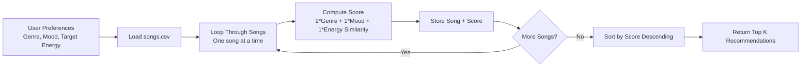

# 🎵 Music Recommender Simulation

## Project Summary

This project builds a CLI-first music recommender that scores each song in `songs.csv` against a user profile and returns the top matches. My version uses a transparent point system: genre match, mood match, and energy similarity all contribute to the final score. I expanded the dataset to 18 songs and tested multiple user profiles, including adversarial edge cases, to see where the logic works well and where bias or oversimplification appears.

---

## How The System Works

This simulator works best as a simple content-based recommender, so the most useful song features are the ones that describe musical vibe rather than the song title or artist name.

Key features in `data/songs.csv`:

- `genre`: the strongest categorical feature for matching broad taste
- `mood`: the clearest short label for the feeling of a song
- `energy`: helpful for separating calm, relaxed songs from intense ones
- `valence`: useful for detecting whether a track feels happy or moody
- `acousticness`: especially useful for distinguishing lo-fi, jazz, ambient, and similar sounds
- `tempo_bpm` and `danceability`: secondary features that refine the recommendation when two songs have a similar vibe

For this dataset, `genre`, `mood`, `energy`, and `valence` are probably the most effective features for a first-pass recommender because they map closely to how people usually describe musical vibe in plain language. `tempo_bpm` and `danceability` still matter, but they are better as tie-breakers than as the main scoring signals.

The `UserProfile` should store a preferred genre, a preferred mood, a target energy level, and whether the user tends to like more acoustic tracks. The `Recommender` can score each song by comparing those preferences to the song attributes, then return the highest-scoring songs.

Simple flow:

`UserProfile` -> compare against `Song` features -> compute a score -> sort songs -> recommend the top results

### Step 2: Create a User Profile

Example taste profile dictionary:

```python
user_profile = {
   "genre": "lofi",
   "mood": "chill",
   "energy": 0.38,
   "valence": 0.58,
   "acousticness": 0.80,
}
```

Why this profile is useful:

- It is specific enough to separate low-energy chill songs from high-energy intense songs.
- It combines categorical preferences (`genre`, `mood`) with numeric targets (`energy`, `valence`, `acousticness`).
- It should rank "chill lofi" tracks above "intense rock" because the distance on energy and acousticness is large.

Inline Chat critique prompt:

"Critique this user profile for my music recommender: {\"genre\": \"lofi\", \"mood\": \"chill\", \"energy\": 0.38, \"valence\": 0.58, \"acousticness\": 0.80}. Will these preferences clearly differentiate intense rock from chill lofi, or is this profile too narrow? Suggest one broader profile and one stricter profile."

### Step 3: Mapping the Logic (Algorithm Recipe)

Use this New Chat prompt for "Scoring Logic Design" with `#file:songs.csv`:

"Using #file:songs.csv, suggest point-weighting strategies for a simple content-based recommender. I want a balanced recipe where genre matters more than mood, and energy is scored by closeness to a target value. Is +2.0 for genre, +1.0 for mood, and energy similarity points a good starting point? Show one conservative version and one stronger-genre version."

Final recipe (starting version):

- `genre_match = 1` if song genre == user genre, else `0`
- `mood_match = 1` if song mood == user mood, else `0`
- `energy_similarity = 1 - abs(song.energy - user.target_energy)`

Score for one song:

`score = 2.0 * genre_match + 1.0 * mood_match + 1.0 * energy_similarity`

How this distinguishes songs:

- Intense rock usually has high energy (for example around `0.90+`) and often different genre/mood labels.
- Chill lofi usually has lower energy (for example around `0.35 to 0.45`) with lofi/chill tags.
- A user with low target energy and chill/lofi preferences will give chill lofi higher scores.

Ranking rule:

- Compute score for every song in the catalog.
- Sort songs from highest to lowest score.
- Return the top `k` songs.

You need both rules: scoring decides fit per song, ranking turns all scores into a recommendation list.

Optional enhancements now supported in code:

- Tempo preference: add `tempo_bpm` to the user profile and set `weights.tempo` to reward BPM closeness.
- Diversity mode: set `diversity_by_genre` to `true` to encourage top results from different genres.

### Step 4: Visualize the Design (Data Flow)

Input -> Process -> Output map:

- Input: user preferences (`genre`, `mood`, `energy` target)
- Process: loop through every song row in `songs.csv`, compute a score for each song
- Output: ranked list of songs, then top `k` recommendations



This diagram represents how a single song moves through the system: it is read from the CSV, scored against the user profile, stored with a score, and then compared to all other songs during ranking.

### Step 5: Bias and Limits Note

Potential bias to expect with this recipe:

- The system may over-prioritize `genre`, which can hide songs from other genres that still match mood and energy very well.
- Mood labels are subjective, so mislabeled songs can be unfairly ranked too low.
- With a small catalog, repeated genres can dominate recommendations.

---

## Getting Started

### Setup

1. Create a virtual environment (optional but recommended):

   ```bash
   python -m venv .venv
   source .venv/bin/activate      # Mac or Linux
   .venv\Scripts\activate         # Windows

2. Install dependencies

```bash
pip install -r requirements.txt
```

3. Run the app:

```bash
python -m src.main
```

### Running Tests

Run the starter tests with:

```bash
pytest
```

You can add more tests in `tests/test_recommender.py`.

---

## Experiments You Tried

Profiles tested (top recommendation):

- High-Energy Pop -> `Sunrise City` (score `3.92`)
- Chill Lofi -> `Library Rain` (score `3.97`)
- Deep Intense Rock -> `Storm Runner` (score `3.99`)
- Edge case: Conflicting Chill + Very High Energy -> `Spacewalk Thoughts` (score `3.33`)
- Edge case: Genreless Energy-Only -> `Night Drive Loop` (score `1.00`)

Why one result ranked first (example):

- `Sunrise City` ranked first for High-Energy Pop because it hit all major criteria at once: genre match (+2.0), mood match (+1.0), and high energy similarity (+0.92).

Small data experiment run:

- Baseline weights: `genre=2.0`, `mood=1.0`, `energy=1.0`
- Experiment weights: `genre=1.0`, `mood=1.0`, `energy=2.0`
- Result: Top songs stayed similar, but scores compressed toward energy-heavy tracks. Songs with strong energy alignment (even cross-genre) moved closer to the top.

Terminal output snapshots (text capture):

```text
=== High-Energy Pop ===
1) Sunrise City ... Score 3.92
2) Gym Hero ... Score 2.97
3) Rooftop Lights ... Score 1.86

=== Chill Lofi ===
1) Library Rain ... Score 3.97
2) Midnight Coding ... Score 3.96
3) Focus Flow ... Score 2.98

=== Deep Intense Rock ===
1) Storm Runner ... Score 3.99
2) Gym Hero ... Score 1.99
3) Neon Festival ... Score 0.98
```

```text
=== Experiment Baseline: Pop/Happy ===
1) Sunrise City ... Score 3.92
2) Gym Hero ... Score 2.97
3) Rooftop Lights ... Score 1.86

=== Experiment Weight Shift: Genre 1.0, Mood 1.0, Energy 2.0 ===
1) Sunrise City ... Score 3.84
2) Gym Hero ... Score 2.94
3) Rooftop Lights ... Score 2.72
```

---

## Limitations and Risks

Summarize some limitations of your recommender.

Examples:

- It only works on a tiny catalog
- It does not understand lyrics or language
- It might over favor one genre or mood

You will go deeper on this in your model card.

---

## Reflection

Read and complete `model_card.md`:

[**Model Card**](model_card.md)

Building this showed me that recommenders are mostly structured comparisons, not magic. My model compares each song's tags and energy against a user profile, turns those matches into points, and ranks songs by total score. Even a simple formula can produce results that feel intuitive when the profile is clear, like Chill Lofi recommending `Library Rain` and `Midnight Coding`.

I also saw how bias enters quickly. Giving genre the largest weight can create a filter bubble where cross-genre songs with good mood and energy alignment are pushed down. The system also depends heavily on labels in the CSV, so if mood or genre tags are noisy, recommendations become unfair or inaccurate.


---

## 7. `model_card_template.md`

Combines reflection and model card framing from the Module 3 guidance. :contentReference[oaicite:2]{index=2}  

```markdown
# 🎧 Model Card - Music Recommender Simulation

## 1. Model Name

Give your recommender a name, for example:

> VibeFinder 1.0

---

## 2. Intended Use

- What is this system trying to do
- Who is it for

Example:

> This model suggests 3 to 5 songs from a small catalog based on a user's preferred genre, mood, and energy level. It is for classroom exploration only, not for real users.

---

## 3. How It Works (Short Explanation)

Describe your scoring logic in plain language.

- What features of each song does it consider
- What information about the user does it use
- How does it turn those into a number

Try to avoid code in this section, treat it like an explanation to a non programmer.

---

## 4. Data

Describe your dataset.

- How many songs are in `data/songs.csv`
- Did you add or remove any songs
- What kinds of genres or moods are represented
- Whose taste does this data mostly reflect

---

## 5. Strengths

Where does your recommender work well

You can think about:
- Situations where the top results "felt right"
- Particular user profiles it served well
- Simplicity or transparency benefits

---

## 6. Limitations and Bias

Where does your recommender struggle

Some prompts:
- Does it ignore some genres or moods
- Does it treat all users as if they have the same taste shape
- Is it biased toward high energy or one genre by default
- How could this be unfair if used in a real product

---

## 7. Evaluation

How did you check your system

Examples:
- You tried multiple user profiles and wrote down whether the results matched your expectations
- You compared your simulation to what a real app like Spotify or YouTube tends to recommend
- You wrote tests for your scoring logic

You do not need a numeric metric, but if you used one, explain what it measures.

---

## 8. Future Work

If you had more time, how would you improve this recommender

Examples:

- Add support for multiple users and "group vibe" recommendations
- Balance diversity of songs instead of always picking the closest match
- Use more features, like tempo ranges or lyric themes

---

## 9. Personal Reflection

A few sentences about what you learned:

- What surprised you about how your system behaved
- How did building this change how you think about real music recommenders
- Where do you think human judgment still matters, even if the model seems "smart"

